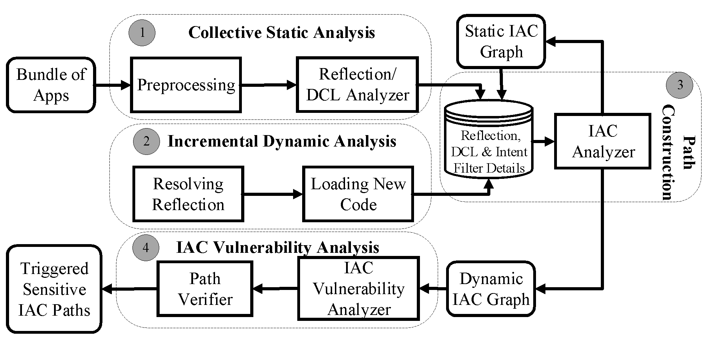

DINA
======

## 1 Overview

- This repo contains the prototype code of DINA, a hybrid analysis tool for identifying potential concealed vulnerable paths through reflection and dynamic class loading between Android Apps.

This work was accepted and will be published at *IEEE International Conference on Computer Communications (INFOCOM) (INFOCOM'19)*.

### 1.1 Implementation

- Written in C++14.
- Uses the [Boost Graph Library (BGL)](http://www.boost.org/libs/graph/doc/).
    - Existing generic graph algorithms can be applied to Jitana data
      structures.
- Can be used as a library:
    - Run side-by-side with a virtual machine on a target device.
    - Run on a host machine talking to the target device via JDWP.
    - Used from visualization tool.

## 2 Building

DINA uses CMake which supports out-of-source build. In this document, the
following directory structure is assumed:

    .
    ├── DINA (source code downloaded)
    ├── dex    (DEX files)
    └── build  (build directory you make)

### 2.1 macOS

Install all the dependencies first. Then

    mkdir build
    cd build
    cmake -DCMAKE_BUILD_TYPE=Release ../DINA
    make -j8

### 2.2 Ubuntu

Please refer to [Compiling Jitana on Linux](https://github.com/ytsutano/jitana/blob/master/doc/jitana_on_ubuntu.md).

## 3 Developer

- Mohannad Alhanahnah at University of Nebraska-Lincoln.
- Please note that DINA has been developed on top of [jitana](https://github.com/ytsutano/jitana). Therefore, many of Jitana's libraries have been used as is or adapted.

## 4 License

- See [LICENSE.md](LICENSE.md) for license rights and limitations (ISC).

# Citation
If you use the source code, please cite the following paper:

M. Alhanahnah et al., "Detecting Vulnerable Android Inter-App Communication in Dynamically Loaded Code," IEEE INFOCOM 2019 - IEEE Conference on Computer Communications, Paris, France, 2019, pp. 550-558.

